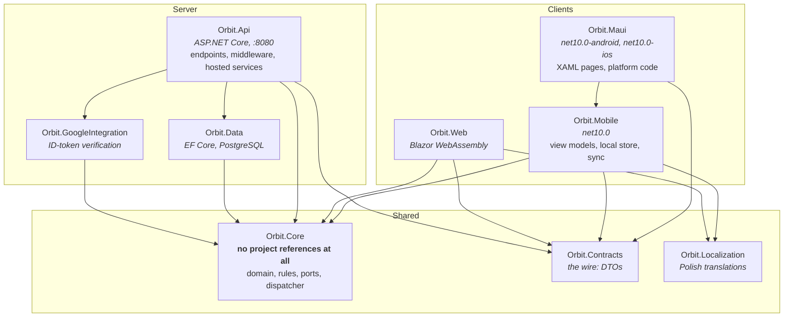
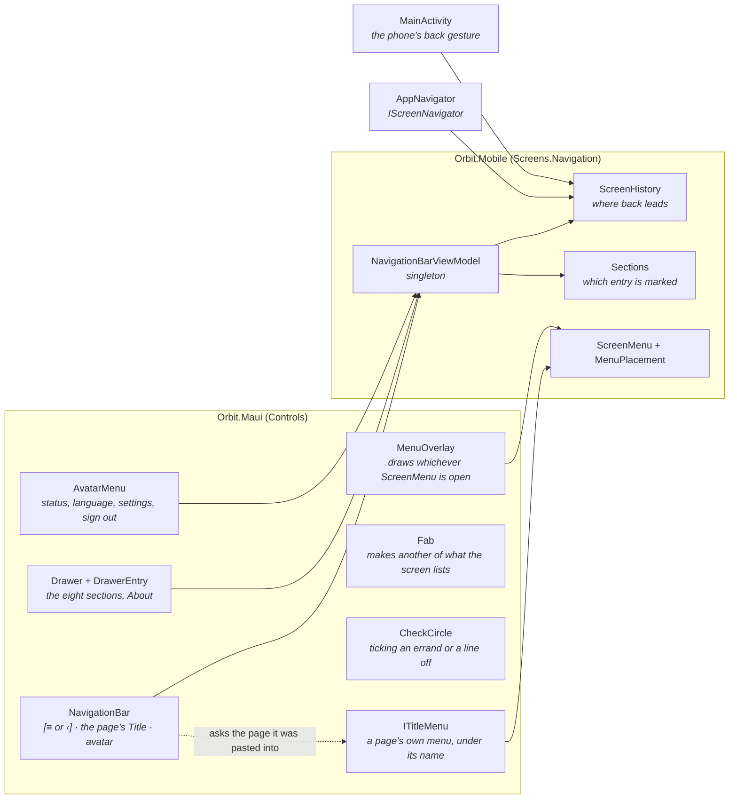

# Components and dependencies

What the solution is made of, and which direction the arrows are allowed to point.

## The one rule the picture is drawn to show

**`Orbit.Core` references no other project.** Everything else points at it and it points at nothing,
which is what keeps the domain independent of EF Core, of ASP.NET, of MAUI and of the wire format. A
reference added *from* `Orbit.Core` to anything is the change worth stopping in review; the rest of the
graph is ordinary.

`Orbit.Core` declares its needs as interfaces — `INoteRepository`, `IEmailSender`,
`IPushNotificationSender`, `ILiveUpdatePublisher`, `IPasswordHasher` — and something outside supplies
them. That is the whole of the ports-and-adapters arrangement here, and it is why the same domain can be
compiled into a server that talks to PostgreSQL and into a phone that does not.

## What "shared" does and does not mean

This is the part a diagram usually gets wrong, so it is stated rather than implied.

**The command/query dispatcher is server-side only.** `IDispatcher` and every `IRequestHandler` run in
`Orbit.Api`. Neither client resolves a dispatcher — they call HTTP endpoints. So `Orbit.Core` is not a
shared *application* layer with two hosts; it is a shared *vocabulary and rulebook* with one host.

What the clients actually take from it is rules that must not be re-decided differently on each side —
`Orbit.Core.Sync`, `Orbit.Core.Permissions`, `Orbit.Core.Tasks`, `Orbit.Core.Inventories`,
`Orbit.Core.Suggestions`, `Orbit.Core.Notifications`. A permission the phone read differently from the
server, or a sync state it named differently, would be a disagreement no compiler could catch.

**The phone keeps its own model.** `Orbit.Mobile.Data` holds `LocalNote`, `LocalTaskList`,
`LocalCalendarEvent`, `LocalInventory`, `LocalChatMessage` and repositories over a local SQLite
database. Those are not implementations of `Orbit.Core`'s repository ports — they are a second store
with a shape of its own, because a phone has to answer while offline and a server never does. The two
are reconciled by the synchronisers rather than by sharing an interface (see [flows](flows.md)).

## `Orbit.Maui` and `Orbit.Mobile`, and why they are two

A MAUI head cannot be reached by an ordinary test project (and `Orbit.CI.slnf`, the filter the suite
builds, leaves it out entirely), so everything that could otherwise
sit in the head — view models, the local store, the sync spine, crypto, the API client — lives in
`Orbit.Mobile`, which is a plain `net10.0` library and therefore testable. `Orbit.Maui` is left with the
XAML and the platform code, which is the part no unit test would reach anyway.

That split is why `tests/Orbit.Mobile.Tests` exists and `tests/Orbit.Maui.Tests` does not.

### The phone's shell

One bar sits on every signed-in page, and three panels hang off it. All four resolve the same
`NavigationBarViewModel` from the container - it is registered as a singleton precisely so they cannot
disagree about which of them is open.

`AppNavigator` replaces the window's page outright - there is no `NavigationPage` and no `Shell`,
because Orbit draws its own bar and a second set of platform chrome would have to be fought rather than
used. What there *is* is a history: every navigation tells `ScreenHistory` how it arrived (a root
clears, a drawer destination resets to the dashboard and itself, anything else pushes), and both the
bar's back arrow and Android's gesture pop the same stack. This replaced `UpNavigation`, which answered
back from a fixed map of parents - right while every editing screen had a rail saying "Back to notes",
and wrong once that rail was taken away.

## Test projects

Left out of the diagram above to keep it about the shipped code:

| Project | References |
| --- | --- |
| `Orbit.Api.Tests` | `Orbit.Api`, `Orbit.Localization` |
| `Orbit.Web.Tests` | `Orbit.Web` |
| `Orbit.Mobile.Tests` | `Orbit.Mobile` |
