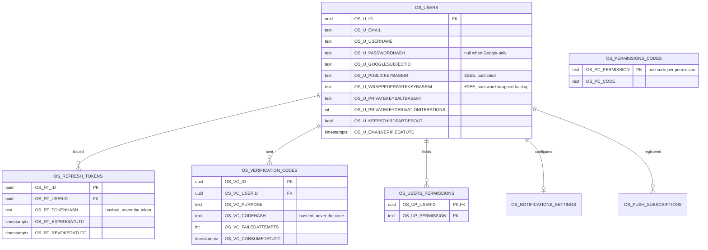
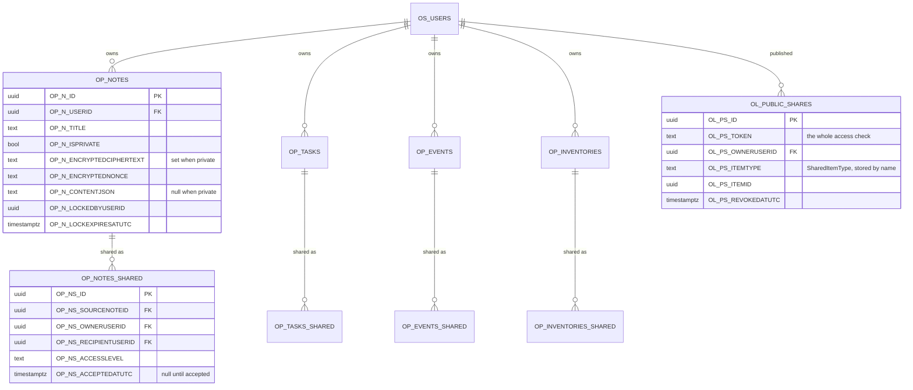
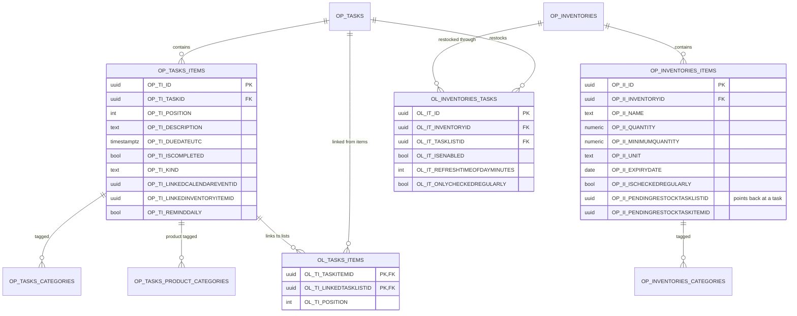
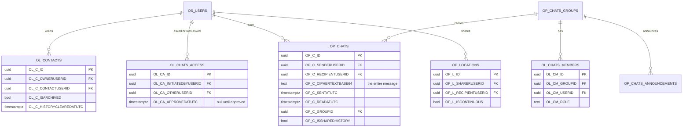
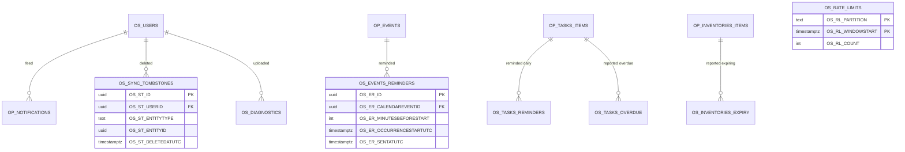

# Database

Forty-one tables in PostgreSQL. Split into five diagrams here, because one picture of all of them would
be a wall rather than a drawing.

## Reading a name

No table or column is left to EF Core's defaults. `Orbit.Data.OrbitStorageNames` holds the physical name
of every one of them and applies it at the end of `OnModelCreating`; **an entity missing from that map
throws at startup** rather than quietly taking a default and drifting out of the convention.

| Prefix | Holds | Example |
| --- | --- | --- |
| `OP_` | what the user works on | `OP_NOTES`, `OP_INVENTORIES_ITEMS` |
| `OL_` | rows whose only job is to join two of those | `OL_CONTACTS`, `OL_PUBLIC_SHARES` |
| `OS_` | accounts, settings, and bookkeeping the system keeps for itself | `OS_USERS`, `OS_RATE_LIMITS` |

A column repeats its table's prefix, shortens the middle to initials and ends with the property name in
upper case: `OP_NOTES.OP_N_TITLE`, `OP_NOTES_SHARED.OP_NS_ACCESSLEVEL`. So a column carries its table
with it in a query that joins several.

The diagrams below use the physical names, since those are what a query is written against.

## Accounts and getting in

Two columns worth naming: `OS_RT_TOKENHASH` and `OS_VC_CODEHASH` store hashes, never the token or the
code. A database that leaked would hand over neither.

`OS_PERMISSIONS_CODES` is keyed on the permission itself, so a second code can never be minted beside
the one somebody was already told.

## The four things a user works on, and how they are shared

Notes, task lists, calendar events and inventories each have a table and a share table beside it with
the same shape.

`OP_TASKS_SHARED`, `OP_EVENTS_SHARED` and `OP_INVENTORIES_SHARED` are the same five columns over a
different source id, so only one is drawn.

**`OL_PS_ITEMTYPE` stores an enum by name and must never be renamed.** It sits in rows already written
and inside chat payloads already delivered; renaming the member orphans every share link that used it.
That is why the enum still says `Warehouse` although everything else says Inventory.

## Tasks and inventories, and the loop between them

**This is the one cycle in the schema.** An inventory names the task list that restocks it, and an
inventory item names the task it is currently waiting on. Both directions are needed — one answers "what
should this shopping list contain", the other "has this been bought yet" — and
`InventoryTaskListCoordinator` is the single place that keeps the two ends agreeing.

`OL_TASKS_ITEMS` is the item-to-list link, and is why a task item can stand for work tracked on other
lists. `TaskListLinkValidator` is what stops one being made into a cycle of its own.

## Chat, which the server stores but cannot read

`OP_CHATS` has **no column for message content**. `OP_C_CIPHERTEXTBASE64` is the message, and nothing on
the server can open it — see [flows](flows.md#chat-that-the-server-cannot-read).

`OL_CHATS_ACCESS` is the row that makes a conversation a conversation: until
`OL_CA_APPROVEDATUTC` is set, one person has asked and the other has not agreed.

## Bookkeeping

Nothing here is the user's; all of it is the system's own record of what it has already done.

**The four delivery tables are claims, not logs.** A row is inserted *before* a notification is sent,
under a unique index, so an instance whose insert loses the race knows another instance has already
claimed that notification. That is what makes the reminder background services safe to run on more than
one replica — see [flows](flows.md).

**`OS_SYNC_TOMBSTONES` is why a delete propagates.** A row that is simply gone is indistinguishable from
one a device has not fetched yet, so a deletion leaves a marker with a timestamp and the device learns
about it from its cursor like any other change.

**`OS_RATE_LIMITS`** is keyed on caller and window together, which is what lets taking a permit be one
`INSERT ... ON CONFLICT DO UPDATE` and therefore safe between replicas.

## Migrations

EF Core generates them and they are reviewed by hand before they are kept — see
[testing-and-running-locally](../testing-and-running-locally.md#database-migrations). The rule that has
caught real damage: **a rename must be written as `RenameTable`/`RenameColumn`.** Left to scaffold it,
EF emits drop-and-create, which is data loss wearing the clothes of a schema change.
