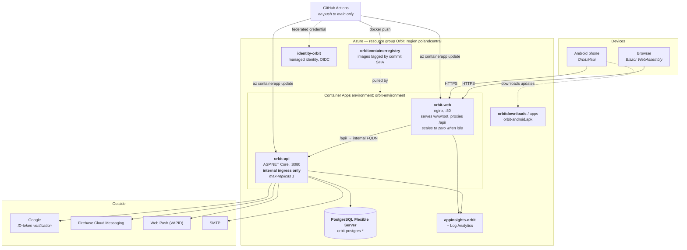
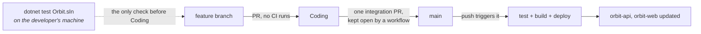

# Deployment

Where the pieces actually run, and what talks to what.

## What the picture is trying to settle

**Nothing reaches `orbit-api` from the internet.** Its ingress is internal to the Container Apps
environment, so the only way in is nginx, which serves the web client and proxies `/api/` to the API's
internal FQDN. The phone goes the same way and is built knowing it: `OrbitApiSettings` bakes in
*`orbit-web`'s* address, not the API's, and every client asks for a relative path so one base address
serves the app exactly as it serves the browser.

That makes `orbit-web` the single public surface for everything, which is why a deploy is validated end
to end through the proxy rather than against the API alone — and why the throttling that does not exist
in front of it matters as much as it does (see [future-plan](../future-plan.md)).

**`orbit-api` runs at `max-replicas 1` today.** Nothing in the code assumes that any more — live
updates, the privacy choice cache and the rate limiter each count across instances — but the number has
not been raised, and doing so is a cost decision rather than a technical one.

**`orbit-web` scales to zero when idle, and will stop.** A client holding a live-update connection open
is not idle. Whoever raises replicas should expect that bill to change shape.

## The pipeline, and why it is shaped that way

Runner minutes are a monthly budget of 2000, and a pipeline that ran on pull requests, on pushes to
`Coding`, and on the integration pull request those synchronised spent them in four days — the same
suite three and four times for one change. So **the suite runs at the one point where it gates
something**: the push to `main`, which is the merge of the integration PR and the last step before Azure
is paid.

The trade this makes deliberately: `dotnet test Orbit.sln` on the machine that wrote the change is the
only check it gets before `Coding`. A broken merge there is found at the next push to `main`, before
anything deploys — and then it blocks everybody's integration, which is why running the suite locally is
a rule rather than a courtesy.

The Android head is compiled by a second workflow on the same trigger, narrowed by a `paths:` filter so
a merge touching nothing mobile starts no runner at all.

## Two things the diagram cannot show

**A direct push to `main` deploys, and nothing can stop it.** `guard-main.yml` closes pull requests
aimed at `main` from anywhere but `Coding`, but a push has already landed by the time any workflow runs.
Real branch protection needs GitHub Pro on a private repository. The arrangement above is a convention
held by rules in `.claude/CLAUDE.md`, not by the repository.

**Secrets are never in the images.** Connection strings, the JWT signing key, the Application Insights
connection string and the push credentials arrive as Container Apps environment variables or secrets.
`.env.example` lists the names; the values live only in Azure and on the developer's machine.

See [azure-setup.md](../azure-setup.md) for the resource-by-resource detail and the OIDC federated
credential format.
