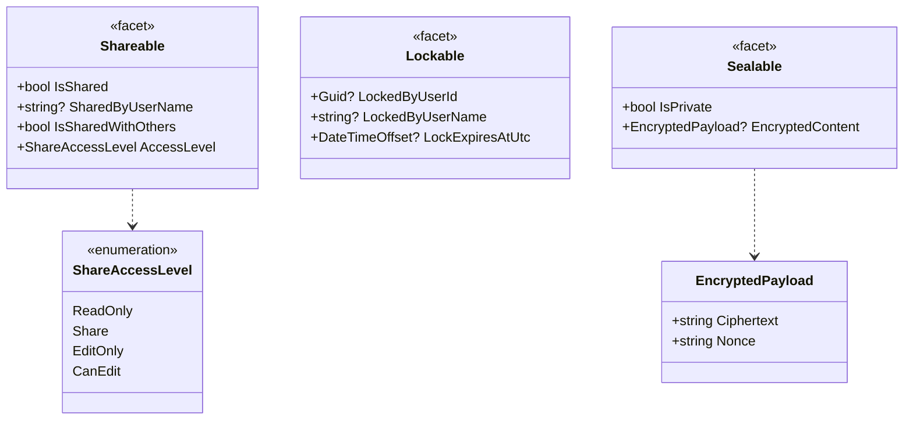
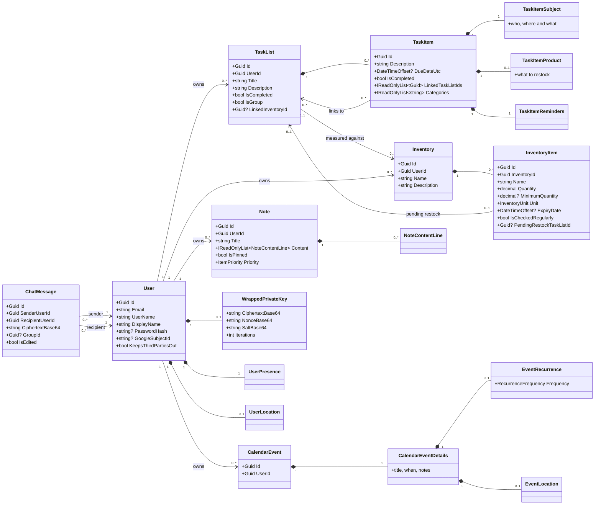
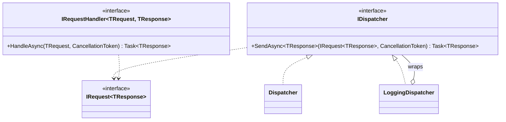

# Domain model

The aggregates in `Orbit.Core`, and the two shapes almost all of them repeat.

## The repeated shapes

Notes, task lists, calendar events and inventories are four different things that answer the same three
questions — who may see this, who is holding it open, and can the server read it. Rather than draw those
fields four times, they are drawn once here and referred to below.

**`Sealable` is not a preference.** `IsPrivate` with an `EncryptedPayload` means the server holds
ciphertext and nothing else — there is no server-side view of that item's content, so no feature can be
added later that reads it. That is why private items never appear in anything the server has to
understand, such as a search the server performs or an assistant prompt it assembles.

**`ShareAccessLevel` is ordered but not linear.** `Share` is not "more than `ReadOnly` and less than
`CanEdit`" — it is the right to pass access on, which `EditOnly` deliberately lacks. `CanGrant` on the
enum decides what a holder may hand to somebody else, and it is the only place that question is
answered.

## The aggregates

`Note`, `TaskList`, `CalendarEvent` and `Inventory` each carry the `Shareable`, `Lockable` and
`Sealable` facets above in full. They are left off this diagram only so the relationships stay
readable.

## What `ChatMessage` does not have

It has no content field. `CiphertextBase64` is the whole of the message as far as this codebase is
concerned, and it is the only chat property no server-side code ever interprets — see
[flows](flows.md#chat-that-the-server-cannot-read) for how the key that opens it never reaches the
server.

This is worth seeing in a class diagram precisely because it is an absence. A reader looking for "where
is the message body handled" will not find it, and the reason is the design rather than an omission.

## The two loops between modules

Most modules are independent. Two are not, and both are deliberate:

- **A task list can be measured against an inventory** (`TaskList.LinkedInventoryId`), and an inventory
  item can point back at the restock task it is waiting on (`InventoryItem.PendingRestockTaskListId`,
  `PendingRestockTaskItemId`). That is a cycle in the data, and `InventoryTaskListCoordinator` plus
  `PendingRestockTaskResolver` exist to keep the two ends agreeing.
- **A task item links to other task lists** (`TaskItem.LinkedTaskListIds`), so completing an item can
  depend on lists elsewhere — `LinkedTaskCompletionResolver` is what decides whether that counts as
  done, and `TaskListLinkValidator` is what stops a link being made into a cycle.

## The dispatcher

Every operation on the above is a request object and a handler, resolved through one interface:

`LoggingDispatcher` decorates rather than replaces, so every request is logged in one place instead of
each handler remembering to. **Only `Orbit.Api` resolves an `IDispatcher`** — see
[components](components.md#what-shared-does-and-does-not-mean).
