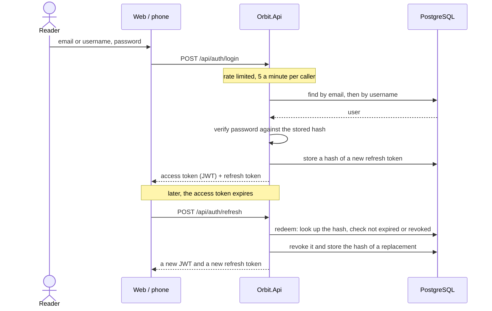
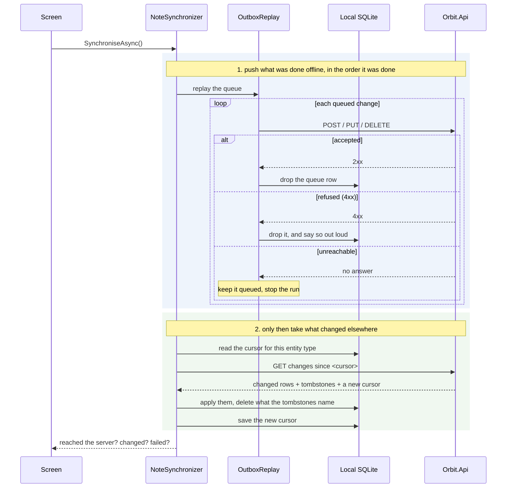
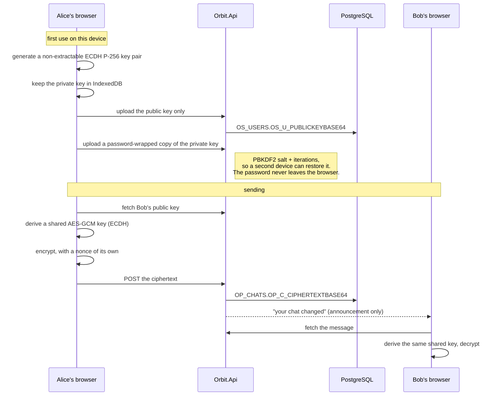
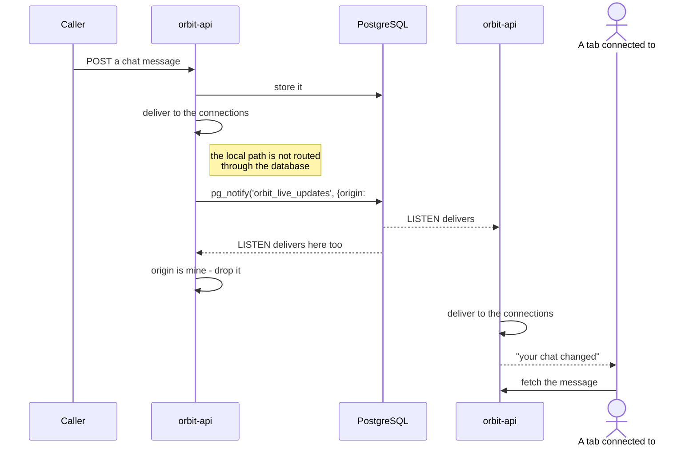
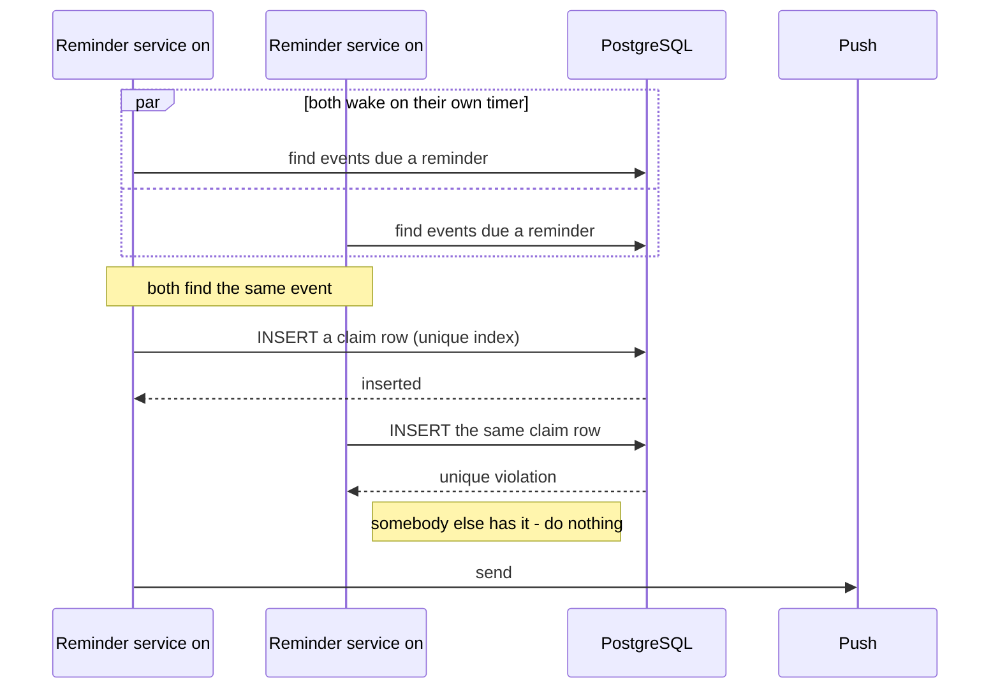

# Flows

Five sequences worth drawing, chosen because in each one the interesting part is the *order*, and
getting the order wrong produces something that still looks like it works.

## Signing in, and staying signed in

**Three things this order buys.**

The refresh endpoint **rotates**: redeeming a refresh token revokes it and issues another. A token that
is presented twice is therefore a token that has been copied, and the second use fails.

Only *hashes* of refresh tokens are stored (`OS_RT_TOKENHASH`), so the table cannot be used to
impersonate anybody even if it is read.

`/refresh` and `/logout` are deliberately **not** on the login rate limit budget. Both are gated by
possession of a refresh token rather than by guessing, and putting them on that budget would let an
ordinary busy client lock itself out of its own session.

Authentication is stateless from there on: the JWT is signed with a symmetric key held in configuration,
so any replica can validate it without shared session state.

## One synchronisation run

The phone works offline first: every edit lands locally and is queued, and a run reconciles.

**Push before pull, and that is the whole design.** An edit made on the phone is on the server *before*
the server's view of that item comes back, so the pull confirms the local change instead of reverting
it. Pulling first would make every offline edit look stale for the length of one round trip — and would
sometimes overwrite it.

**A refused change is dropped, not retried.** A 4xx means the server has considered the request and will
not have it; retrying forever would wedge the queue behind one bad row. It is dropped, the next pull
restores the server's version — and because somebody's edit just disappeared, this is the one outcome
the reader is told about rather than handled silently.

**The cursor is opaque to the client.** It is whatever the server handed back, stored and returned
unread, so the two never have to agree on what a cursor *means*.

**Deletes travel as tombstones.** A row that is simply gone looks exactly like a row this device has not
fetched yet, so a deletion leaves `OS_SYNC_TOMBSTONES` behind and arrives like any other change.

## Chat that the server cannot read

**Notice what never crosses the middle.** Orbit.Api stores and relays a base64 string. There is no
column for message content, no code path that decrypts one, and no key on the server that could. The
announcement it sends Bob carries no content either — it says "something changed", and Bob's client
fetches, which is the same reason `ILiveUpdatePublisher` carries nothing anywhere else.

**The honest limitation, stated because a diagram like this invites the opposite assumption.** There is
no out-of-band verification of public keys. A browser trusts whatever public key Orbit.Api reports for
the other party, so a malicious or compromised *server* could substitute one and read what followed.
This protects the messages at rest and from anybody reading the database; it is not a defence against
Orbit itself. Fingerprint comparison is what would close that, and it is not built.

## An announcement reaching every replica

**Local first, then the wire.** The instance that did the work tells its own connections directly, so
the common case keeps the latency and reliability it had when there was only one replica. The notice is
added beside that, never in front of it: if the database refuses it, everybody on #1 has still been
told.

**The origin stamp is what stops a double delivery.** `NOTIFY` comes back to the sender, and the sender
has already delivered, so an instance drops its own notices.

**Nothing here is durable, on purpose.** A notice sent while #2 was reconnecting is lost, and that is
allowed: every announcement is answered by "read again from the cursor you hold", so hearing it late or
not at all costs a delay and never a message. The clients keep a slow poll running underneath for
exactly this.

## A reminder that is sent once, however many replicas are running

**The claim is inserted before the send, not after.** Writing it afterwards would leave a window in
which both instances had sent and neither had recorded it. The unique index is the whole of the
coordination — no lock, no queue, no leader election — and it is why
`OS_EVENTS_REMINDERS`, `OS_TASKS_REMINDERS`, `OS_TASKS_OVERDUE` and `OS_INVENTORIES_EXPIRY` exist as
tables of their own.

The worst case is a claim written and the send then failing, which costs a missed reminder rather than a
duplicate one. That is the direction chosen deliberately: a reminder arriving twice is worse than a
reminder arriving once and late.
